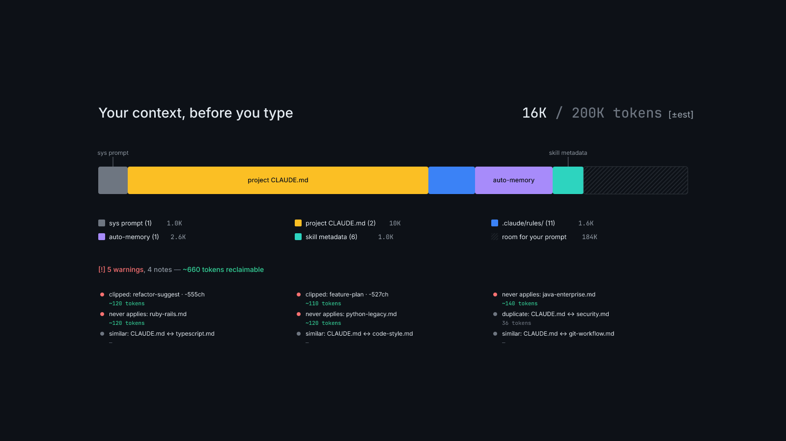

<!-- Repo URL appears below as https://github.com/<repo>/context-surgeon; find-replace at launch. -->

# context-surgeon

See what Claude Code actually loads into context before you type.



Every Claude Code session starts with ~18,000 tokens of your own config. Most developers have never actually read them.

```
npx context-surgeon
```

## What it finds

- **Clipped skill descriptions.** Claude Code silently truncates skill descriptions at 1,536 characters. `context-surgeon` tells you which ones, and by how much.
- **Rules that can't apply.** Rules with a `paths:` frontmatter that matches no files in your repo still get loaded into every session.
- **Duplicates.** The same paragraph pasted into `CLAUDE.md` and a `.claude/rules/` file ships twice, every time.
- **Possible conflicts.** Paragraphs across your config that say overlapping things. Offline mode flags candidates; exact mode (with `ANTHROPIC_API_KEY` set) classifies them as real contradictions or not.

## Install and usage

```bash
# zero-install, one shot
npx context-surgeon

# global install, same command
npm install -g context-surgeon
context-surgeon

# write the hero SVG + PNG for sharing
npx context-surgeon --out dist/

# exact-mode token counts and automated conflict detection
ANTHROPIC_API_KEY=sk-... npx context-surgeon

# machine-readable report for scripts and CI
npx context-surgeon --json
```

## Exit codes

- `0` — no warning-severity findings, no errors. Safe for pre-commit hooks.
- `1` — at least one warning-severity finding, or an error. Info-severity notes (the `possible-conflict` category in offline mode) do not fail the process.

## As a Claude Code skill

`skill-package/SKILL.md` installs into `~/.claude/skills/context-surgeon/` and lets Claude Code run the audit on request. Claude invokes the CLI through a subprocess and surfaces findings in chat. See `skill-package/README.md` for install and skill mechanics.

## How it works

1. **Discovery** walks ancestor `CLAUDE.md`, `CLAUDE.local.md`, `.claude/rules/**`, `.claude/skills/*/SKILL.md`, and `.claude/memory/**`.
2. **Parser** normalises YAML frontmatter and strips HTML block comments (matching Claude Code's own rule — comments inside fenced code blocks are preserved).
3. **Import resolver** expands `@path/to/file` chains up to five hops, with cycle detection and backtick-aware ref extraction.
4. **Tokenizer** counts every source — offline via the bundled Anthropic tokenizer (labelled `[±est]`), or exact via the Anthropic API when `ANTHROPIC_API_KEY` is set.
5. **Analyzer** runs four checks in parallel: clipped descriptions, path/language mismatches, duplicates (TF-IDF cosine over character n-grams), and conflicts (LLM-classified in exact mode).
6. **Renderer** emits terminal ANSI, static SVG, or rasterized PNG from a shared `Report` object.

## How this differs from other tools

Most Claude Code tooling measures what a session already spent. `context-surgeon` audits what's always loaded before you prompt — the fixed budget that eats into every turn. Closer in spirit to `webpack-bundle-analyzer` than to any AI-ops platform.

## Limitations

- Offline token counts use the bundled Anthropic tokenizer. They're estimates, not exact — they may drift from the API's counts by a few percent. Set `ANTHROPIC_API_KEY` for exact counts.
- Conflict detection needs an API key too. Without one, `context-surgeon` emits `possible-conflict` candidates (pairs of paragraphs on overlapping topics) rather than verdicts.
- The language-mismatch heuristic is English-only.
- No auto-rewrite. `context-surgeon` surfaces findings; you edit.

## Contributing

See `CONTRIBUTING.md`. This project follows the [Contributor Covenant 2.1](https://www.contributor-covenant.org/version/2/1/code_of_conduct/) for community conduct.

## License

MIT. See `LICENSE`.
